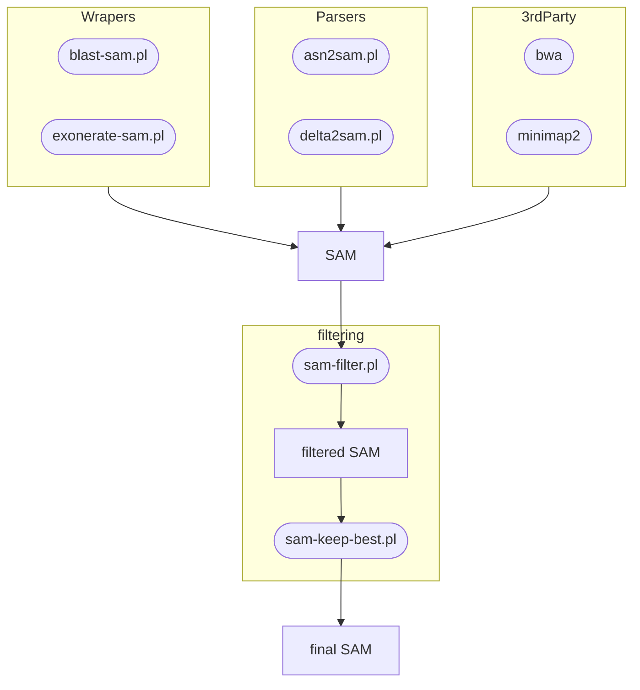
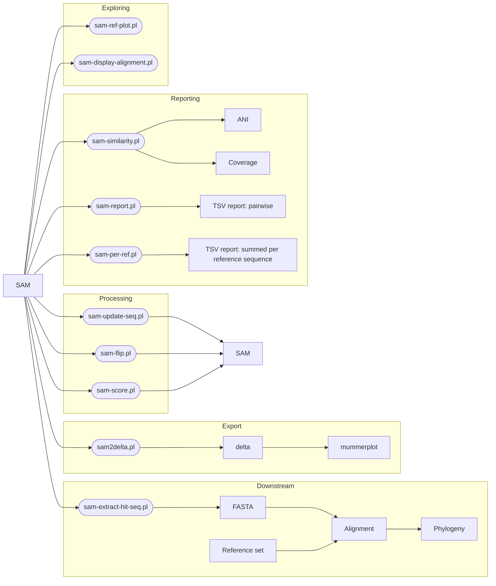

# SAM harmonization

The SAM harmonization package provides tools that can be used for building
interoperable and modular analysis pipelines for NGS based detection,
diagnostics or analytics.

In bioinformatics, the biggest hurdle is converting the different formats so
that programs can use the output of other programs. The main concept in the
setup and design of this toolbox is to convert the output of all the programs
that we want to use for primary analysis (read-mapping or homology tools) to
a standard format.

We have chosen for the SAM (or BAM which is the compressed form) format,
because it is the standard output for read-mapping tools, it is a sufficiently
flexible and robust format, and many programs accept it as input (including
visualization tools such as [pavian](https://github.com/fbreitwieser/pavian)).

Since read-mapping tools already produce correct SAM output, we only needed to
make sure that outputs of the 3 most commonly used (nucleotide to nucleotide)
homology tools (BLAST, nucmer and exonerate) are converted in to correct SAM
formats. In order to validate correct conversion between formats, additional
tools were developed that can be also used for other purposes, like in-depth
exploration of the data or conversion between formats.

The "middle part" of workflows consists of filtering steps to process your raw
output from the primary analysis (mapping, alignment or other homology tools).
Since [samtools](http://samtools.github.io/) already provides many useful tools
for this. The goal for this project was to add tools for common filtering
steps that are not covered by samtools (but maybe included in CLC genomic
workbench and similar tools).

These different filtering options are covered by two scripts (sam-filter.pl & sam-keep-best.pl).
The first (sam-filter.pl) filter is based on thresholds:

- length of alignment,
- level of similarity or
- length of the query (read or contig sequence).

The second (sam-keep-best.pl) filter is context based;
it chooses the best (highest total alignment score) reference hit for a given query.
Longer sequence can produce several hits to the same reference sequence due to
non-homologous sequences, this step makes sure that this does not interfere with the results.

The additional tools are designed:

- to update SAM annotation or encoding to match between different tools,
- to generate simple reporting formats (TSV),
- to visualize results on the command line for explorative purposes,
- to convert into formats that can be used by existing 3rd party tools.

Toolbox mainflow (input + filtering)

```mermaid
flowchart TD
  subgraph Wrapers
    direction LR
    b2s([blast-sam.pl])
    exo([exonerate-sam.pl])
  end
  Wrapers --> SAM
  subgraph Parsers
    direction LR
    asn([asn2sam.pl])
    d2s([delta2sam.pl])
  end
  Parsers -->SAM
  subgraph 3rdParty
    direction LR
    bwa([bwa])
    mini([minimap2])
  end
  3rdParty -->SAM
  SAM --> samf([sam-filter.pl])
  subgraph filtering
    samf --> SAM2[filtered SAM]
    SAM2 --> keep([sam-keep-best.pl])
  end
  keep --> SAM3[final SAM]
```

## Overview of tools

1. Getting alignment, hit or homology data to SAM
    - `blast-sam.pl`: BLAST wrapper. Although BLAST has the option to save to SAM, it does not produce a valid SAM output, hence this wrapper.
    - `asn2sam.pl`: BLAST ASN.1 (archive) converter
    - `exonerate-sam.pl`: exonerate wrapper
    - `delta2sam.pl`: delta (nucmer) converter
2. filtering SAM
    - `sam-filter.pl`: filters SAM entries (hits) based on criteria specified by the user. Hits that are kept need to meet all the criteria specified. Options:
        + Minimum length of the query(/read/subject)  `-minlen=(\d+)`
        + Minimum alignment length (including indel positions) `-minaln=(\d+)`
        + Minimum similarity score (in decimal format) `-minsim=(\d?\.\d+)`
    - `sam-keep-best.pl`: keep only the best reference for each query
        + Selection criterion is the alignment score (`AS:i:\d+`, see [alignment score section](#alignment-score)) summed for each query and reference pair
        + Use bitscore as selection criteria (`BS:i:\d+`; only possible for BLAST output as SAM)
3. process or annotate SAM
    - `sam-score.pl`: recalculate alignment score (`AS:i:\d+`, see [alignment score section](#alignment-score)) for each hit. Uses the default exonerate scoring. This can be used to make results of multiple primary analysis comparable.
    - `sam-flip.pl`: Switch reference to be query and query to be reference. (Currently, this changes SEQ to `*`.)
    - `sam-update-seq.pl`: Add nucleotide sequence for SEQ column. (Secondary mappings or `sam-flip.pl` output may have `*` instead of the actual sequence.)
    - `sam-update-cigar.pl`: Changes the CIGAR encoding to the classical one (both match and mismatch as `M`)
    - `sam-update-iupac.pl`: Corrects CIGAR and `NM:i` scores for IUPAC sites in the reference sequence (useful when looking for primer and probe sites)
4. reporting: aggregation of info from SAM files
    - `sam-similarity.pl`: calculate ANI and coverage for the reference and query files. Ideal for comparing two (bacterial) genomes.
    - `sam-report.pl`: aggregate statistics for sequence pairs
    - `sam-per-ref.pl`: aggregate statistics for each reference sequence (similar to `sam-report.pl`, but query sequences are pooled per reference sequence and only the number of sequences is shown instead of seqID)
    - `sam-hit-info.pl`: print TSV format hit info that can be used for visualizing reference coverage by the hits
5. downstream processes for SAM
    - `sam-extract-hit-seq.pl`: Extract the sequence of the query covered by the hit and print it in FASTA format with some info on the alignment.
6. explore SAM data: intended for exploratory analysis and not for reporting or as an automated workflow step
    - `sam-ref-plot.pl`: For each hit give a rough ASCII graphic coverage of the reference by the query. Also show IDs, percent covered and total lengths of reference and query, and similarity in decimal format. 
    - `sam-display-alignment.pl`: For each hit give a exonerate like alignment view output plus rough ASCII graphic coverage of both reference and query by the hit.
        + FASTA file containing reference sequences has to be specified as the second argument.
7. other
    - `sam2delta.pl`: SAM to delta. Any SAM file can be converted for visualizing using mummerplot.

Toolbox starting from SAM:

```mermaid
flowchart LR
  SAM --> seq([sam-update-seq.pl])
  SAM --> flip([sam-flip.pl])
  SAM --> score([sam-score.pl])
  subgraph Processing
    seq
    flip
    score
  end
  seq --> pSAM[SAM]
  flip --> pSAM
  score --> pSAM
  SAM --> s2d([sam2delta.pl])
  SAM --> extract([sam-extract-hit-seq.pl])
  subgraph Downstream
    extract --> FASTA
    FASTA --> aln
    ref[Reference set] --> aln[Alignment]
    aln --> nwk[Phylogeny]
  end
  subgraph Export
    s2d --> delta
    delta --> mummerplot
  end
  SAM --> sim
  SAM --> report
  SAM --> report2
  subgraph Reporting
    sim([sam-similarity.pl]) --> ANI
    sim --> Coverage
    report([sam-report.pl]) --> TSV[TSV report: pairwise]
    report2([sam-per-ref.pl]) --> TSV2[TSV report: summed per reference sequence]
  end
  SAM --> plot
  SAM --> display
  subgraph Exploring
    plot([sam-ref-plot.pl])
    display([sam-display-alignment.pl])
  end
  
```
