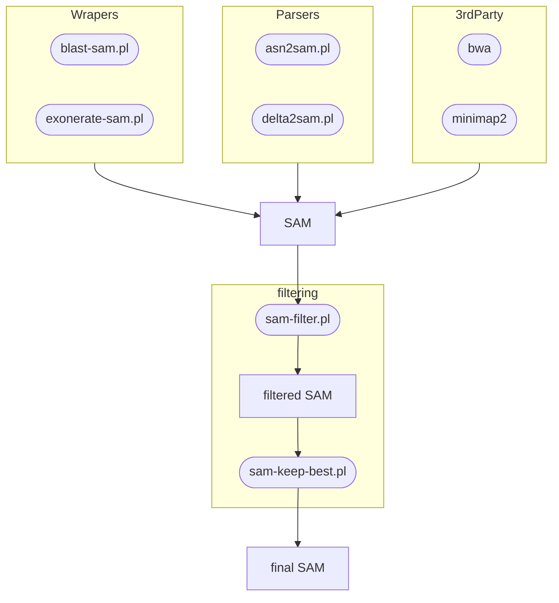

# SAM harmonization

In bioinformatics, the biggest hurdle is converting the different formats so
that programs can use the output of other programs. The main concept in the
setup and design of this toolbox is to convert the output of all the programs
that we want to use for primary analysis (read-mapping or homology tools) to
a standard format.
We have chosen for the SAM (or BAM which is the compressed form) format,
because it is the standard output for read-mapping tools, it is a sufficiently
flexible and robust format, and many programs accept it as input (including
visualization tools such as [pavian](https://github.com/fbreitwieser/pavian)).
Since read-mapping tools already produce correct SAM output, we only needed to
make sure that outputs of the 3 most commonly used (nucleotide to nucleotide)
homology tools (BLAST, nucmer and exonerate) are converted in to correct SAM
formats. In order to validate correct conversion between formats, additional
tools were developed that can be also used for other purposes, like in-depth
exploration of the data or conversion between formats.

The "middle part" of workflows consists of filtering steps to process your raw
output from the primary analysis (mapping, alignment or other homology tools).
Since [samtools](http://samtools.github.io/) already provides many useful tools
for this. The goal for this project was to add tools for common filtering
steps that are not covered by samtools (but maybe included in CLC genomic workbench).

These different filtering options are covered by two scripts (sam-filter.pl & sam-keep-best.pl).
The first (sam-filter.pl) filter is based on thresholds:
- length of alignment,
- level of similarity or
- length of the query (read or contig sequence).
The second (sam-keep-best.pl) filter is context based;
it chooses the best (highest total alignment score) reference hit for a given query.
Longer sequence can produce several hits to the same reference sequence due to
non-homologous sequences, this step makes sure that this does not interfere with the results.

The additional tools are designed:
- to generate simple reporting formats (TSV),
- to visualize results on the command line for explorative purposes,
- to convert into formats that can be used by existing 3rd party tools.

1. Getting alignment, hit or homology data to SAM
    - `blast-sam.pl`: BLAST wrapper. Although BLAST has the option to save to SAM, it does not produce a valid SAM output, hence this wrapper.
    - `asn2sam.pl`: BLAST ASN.1 (archive) converter
    - `exonerate-sam.pl`: exonerate wrapper
    - `delta2sam.pl`: delta (nucmer) converter
2. filtering SAM
    - `sam-filter.pl`: filters SAM entries (hits) based on criteria specified by the user. Hits that are kept need to meet all the criteria specified. Options:
        + Minimum length of the query(/read/subject)  `-minlen=(\d+)`
        + Minimum alignment length (including indel positions) `-minaln=(\d+)`
        + Minimum similarity score (in decimal format) `-minsim=(\d?\.\d+)`
    - `sam-keep-best.pl`: keep only the best reference for each query
        + Selection criterion is the alignment score (`AS:i:\d+`, see [alignment score section](#alignment-score)) summed for each query and reference pair
        + Use bitscore as selection criteria (`BS:i:\d+`; only possible for BLAST output as SAM)
3. process or annotate SAM
    - `sam-score.pl`: recalculate alignment score (`AS:i:\d+`, see [alignment score section](#alignment-score)) for each hit. Uses the default exonerate scoring. This can be used to make results of multiple primary analysis comparable.
    - `sam-flip.pl`: Switch reference to be query and query to be reference. (Currently, this changes SEQ to `*`.)
    - `sam-update-seq.pl`: Add nucleotide sequence for SEQ column. (Secondary mappings or `sam-flip.pl` output may have `*` instead of the actual sequence.)
    - `sam-update-cigar.pl`: Changes the CIGAR encoding to the classical one (both match and mismatch as `M`)
    - `sam-update-iupac.pl`: Corrects CIGAR and `NM:i` scores for IUPAC sites in the reference sequence (useful when looking for primer and probe sites)
4. reporting: aggregation of info from SAM files
    - `sam-similarity.pl`: calculate ANI and coverage for the reference and query files. Ideal for comparing two (bacterial) genomes.
    - `sam-report.pl`: aggregate statistics for sequence pairs
    - `sam-per-ref.pl`: aggregate statistics for each reference sequence (similar to `sam-report.pl`, but query sequences are pooled per reference sequence and only the number of sequences is shown instead of seqID)
    - `sam-hit-info.pl`: print TSV format hit info that can be used for visualizing reference coverage by the hits
5. downstream processes for SAM
    - `sam-extract-hit-seq.pl`: Extract the sequence of the query covered by the hit and print it in FASTA format with some info on the alignment.
6. explore SAM data: intended for exploratory analysis and not for reporting or as an automated workflow step
    - `sam-ref-plot.pl`: For each hit give a rough ASCII graphic coverage of the reference by the query. Also show IDs, percent covered and total lengths of reference and query, and similarity in decimal format. 
    - `sam-display-alignment.pl`: For each hit give a exonerate like alignment view output plus rough ASCII graphic coverage of both reference and query by the hit.
        + FASTA file containing reference sequences has to be specified as the second argument.
7. other
    - `sam2delta.pl`: SAM to delta. Any SAM file can be converted for visualizing using mummerplot.


Primary analysis


Toolbox mainflow (input + filtering)


Toolbox starting from SAM:


Metadata aspects (to do):
- Comment lines could be used to store input file information
- Reference sequence can hold assembly ID information
- We could add Line to the header for storing provenance info of the runs

## SAM format

> Format description: [https://samtools.github.io/hts-specs/SAMv1.pdf](https://samtools.github.io/hts-specs/SAMv1.pdf)

| Col | Field | Type   | Brief description |
| :-- | :--   | :-- | :-- |
| 1   | QNAME |	String | Query template NAME |
| 2   | FLAG  | Int    | bitwise FLAG |
| 3   | RNAME | String | References sequence NAME | 
| 4   | POS   | Int    | 1-based leftmost mapping POSition |
| 5   | MAPQ  | Int    | MAPping Quality |
| 6   | CIGAR | String | CIGAR String |
| 7   | RNEXT | String | Ref. name of the mate/next read |
| 8   | PNEXT | Int    | Position of the mate/next read |
| 9   | TLEN  | Int    | observed Template LENgth |
| 10  | SEQ   | String | segment SEQuence |
| 11  | QUAL  | String | ASCII of Phred-scaled base QUALity+33 |

Bitwise Flags

| Integer | Binary | Description (Paired Read Interpretation) |
| --:  | :--   | :-- |
| 1    | 000000000001 | template having multiple templates in sequencing (read is paired) |
| 2    | 000000000010 | each segment properly aligned according to the aligner (read mapped in proper pair) |
| 4    | 000000000100 | segment unmapped (read1 unmapped) |
| 8    | 000000001000 | next segment in the template unmapped (read2 unmapped) |
| 16   | 000000010000 | SEQ being reverse complemented (read1 reverse complemented) |
| 32   | 000000100000 | SEQ of the next segment in the template being reverse complemented (read2 reverse complemented) |
| 64   | 000001000000 | the first segment in the template (is read1) |
| 128  | 000010000000 | the last segment in the template (is read2) |
| 256  | 000100000000 | not primary alignment |
| 512  | 001000000000 | alignment fails quality checks |
| 1024 | 010000000000 | PCR or optical duplicate |
| 2048 | 100000000000 | supplementary alignment (e.g. aligner specific, could be a portion of a split read or a tied region) |

- unmapped: 4
- reverse: 16

The CIGAR operations are given in the following table (set ‘*’ if unavailable):

| Op | BAM | Consumes query | Consumes reference | Description |
| --- | --- | ---           | ---                | :--         |
| M  | 0   | yes            | yes                | alignment match (can be a sequence match or mismatch) |
| I  | 1   | yes            | no                 | insertion to the reference |
| D  | 2   | no             | yes                | deletion from the reference |
| N  | 3   | no             | yes                | skipped region from the reference |
| S  | 4   | yes            | no                 | soft clipping (clipped sequences present in SEQ) |
| H  | 5   | no*            | no                 | hard clipping (clipped sequences NOT present in SEQ) |
| P  | 6   | no             | no                 | padding (silent deletion from padded reference) |
| =  | 7   | yes            | yes                | sequence match |
| X  | 8   | yes            | yes                | sequence mismatch |

> __*__ `H` Does consume the query, but it does not consume the SEQ sequences. Sum of `H` operations plus the length of SEQ equeals the length of the original query sequence.

- “Consumes query” and “consumes reference” indicate whether the CIGAR operation causes the alignment to step along the query sequence and the reference sequence respectively.
- `H` can only be present as the first and/or last operation.
- `S` may only have `H` operations between them and the ends of the CIGAR string.
- For mRNA-to-genome alignment, an `N` operation represents an intron.  For other types of alignments, the interpretation of `N` is not defined.
- Sum of lengths of the M/I/S/=/X operations shall equal the length of SEQ. Sum of `H` operations plus the length of SEQ equeals the length of the original query sequence.

A CIGAR string is a set of length operation pairs: an integer marking the length of the opration. E.g. 150M means that 150 bp are aligned as match and/or mismatch.

## BLAST to SAM

BLAST can produce a SAM output, but it is **not a valid SAM file**. The main problem that `NM:i:<int>` is not correct it should be the edit distance gaps (indel) plus mismatch, but it is only mismatch.

```
# Build blast DB with taxIDs
~/Programs/ncbi-blast-2.9.0/bin/makeblastdb -taxid_map test_map.txt  -in set1.fas -dbtype nucl -parse_seqids
# Run blast and print SAM format
~/Programs/ncbi-blast-2.9.0/bin/blastn -query set2.fas -db set1.fas -outfmt 17 -parse_deflines >blast.sam
```
BLAST edit distance is not correct (NM:i:\d+). It only contains the [IDN] operations, not the mismatches!!

- `AS:i:1808` - integer alignment score, here 1808 (`score`)
- `NM:i:0` - integer edit distance, here 0
Plus non-standard tags:
- `EV:f:0` - float e-value, here 0 (`evalue`)
- `PI:f:96.55` - float percent identify, here 96.55
- `BS:f:701.049` - float bit-score, here 701.049 (`bitscore`)

`blast-sam.pl` is a wrapper to produce SAM format blast hits

`asn2sam.pl` is wrapper for `blast_formatter` to produce a SAM format. By using the ASN format, it is possible to run BLAST once and generate multiple formats from the results.

```
makeblastdb -taxid_map test_map.txt  -in set1.fas -dbtype nucl -parse_seqids
blastn -query set2.fas -db set1.fas -outfmt 11 -parse_deflines >blast.asn
asn2sam.pl blast.asn >blast.sam
```

### Portability of asn files

ASN.1 is not a stand alone file, it requires the reference index files.
The location of the reference file used for creating the blast DB is stored in the ASN.1 as a relative path to the working directory where the blast command was executed. For example:

```
subject database "dir1/ref.fas",
```

In this case it is in `dir1` folder and the original input fasta is called `ref.fas`.
So when ASN.1 is read by `blast_formatter` it will look for the indices in `dir1` folder relative to where `blast_formatter` is called, not relative to the ASN.1 file.
The actual `ref.fas` files is not needed only the index files generated by `makeblastdb`.

It specifically relies on finding `$subject-db\.ndb` and `$subject-db\.nin`. The rest of the files don't seem to be needed for this step. (Probably needed to run a BLAST on the db.)

## Alignment score

Alignment score is stored in the optional field in SAM with `AS:i:` tag as an integer.
Different programs calculate alignment scores in different ways.
To combine the results from different methods, scores have to be calculated in the same way.
Nucmer does not calculate alignment scores, so during conversion from delta it would be useful to calculate a score.

### Defalut scoring in exonerate

Based on test data, the following rewards and penalties can be estimated and the following equation.

| Type | weigth |
| --- | --- |
| identical | 5 |
| mismatch | -4 |
| gap extend | -4 |
| gap open | -12 |

```math
Score = 5 * (l_{alignment} -  d_{edit}) - 4 * d_{edit} - 8 * n_{gaps} = 5 * l_{alignment} - 9 * d_{edit} - 8 * n_{gaps}
```
Where $`l_{alignment}`$ is the alignment length, $`d_{edit}`$ is the edit distance (`NM:i:<int>`) and $`n_{gaps}`$ is the number of gaps (number of [IDN] in the CIGAR)

### Defalut scoring in blast

Based on test data, the following rewards and penalties can be estimated and the following equation.

| Type | weigth |
| --- | --- |
| identical | 1 |
| mismatch | -2 |
| gap extend | -2 |
| gap open | -3 |

```math
Score = (l_{alignment} -  d_{edit}) - 2 * d_{edit} - 1 * n_{gaps} = l_{alignment} - 3 * d_{edit} - 1 * n_{gaps}
```

Where $`l_{alignment}`$ is the alignment length, $`d_{edit}`$ is the edit distance (`NM:i:<int>`) and $`n_{gaps}`$ is the number of gaps (number of [IDN] in the CIGAR)

This does not match the scores for inserts for some reason. Could not identify what goes wrong there. It does not seem to use a linear model for introns. Maybe there is a different scoring system that gets rounded to integers.

